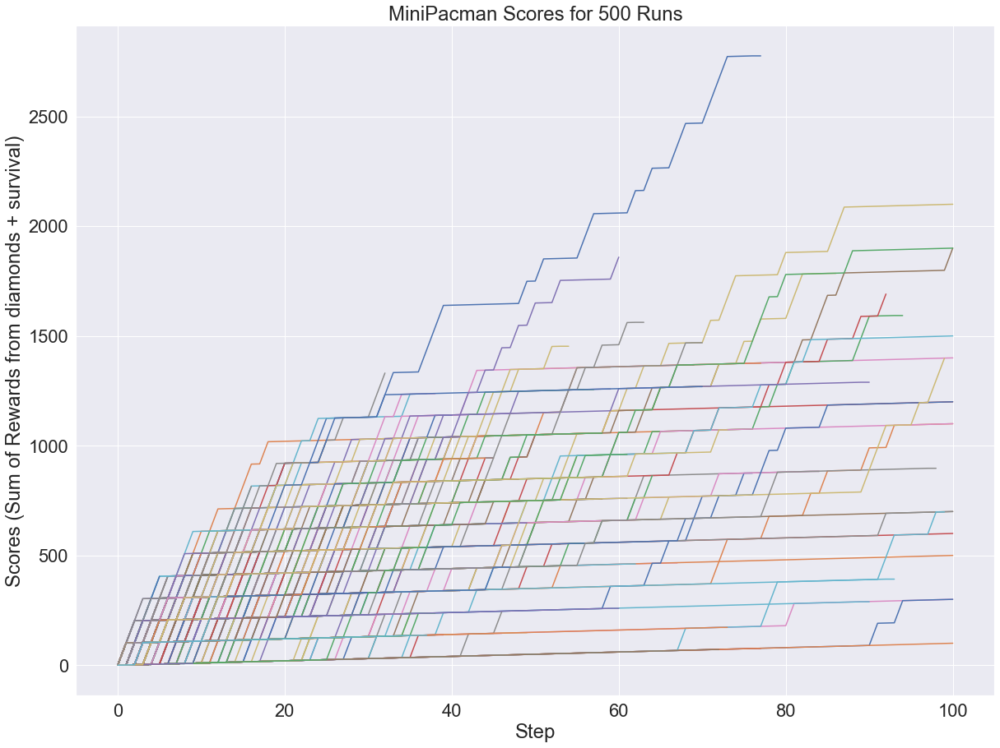

# Deep Q-Learning Models & Experimentation
#### Scripts are based on a few Gym Environments (MsPacman-ram-v0, CartPole-v0, & MountainCar-v0) + Custom Pacman Environment.

 # Best Run from the Ms-Pacman env

# Final model implementations/architecture:

## 1. Double DQN

In this alteration to Vanilla DQN, we seperate the decision making and calculation of q-values to two seperate networks. The idea behind this is so that we do not have a constantly moving target for the network. We copy the weights every 5 compelte episodes (i.e. when pacman dies).
- The target network’s responsibility is simply generates the Q values
- The online model determines which is the best action.

More formally, Double DQN generates target values according to:

## 2. Prioritized Experience Replay (PER)

Schaul et al.’s 2016 paper proposes a solution, known as prioritized experience replay (PER) in which memories used to train the deep networks are sampled based on their temporal difference error. The idea behind this is htat it is more efficient to learn from the experiences where it is the most wrong, rather than a random batch of experiences.  In PER, we use an additional data structure that keeps a record of the priority of each transition. Experiences are then sampled proportional to their priorities:

There is also the detail of importance sampling weights, which are meant to compensate for the fact that we are now intentionally feeding the network data that will cause abnormally large gradient updates.

## 3. Noisy Net Layers

A large part of RL is the problem of exploration vs. exploiation. The Vanilla DQN usually uses an epsilon greedy strategy, where it selects the best action 1 - epsilon of the time (i.e. epsilon is the probability of random action choice).

It would be much better if the agent could learn to control its exploration the same way it learns to control the rest of its decision-making — through gradient descent. In 2017, Fortunato et al. released the solution that made that possible: Noisy Networks.

The epsilon Q greedy approach falls under the umbrella of action space noise exploration methods. In a Noisy Network, we instead inject noise into the weights of the neural network itself (the parameter space).

Noisy Networks replace the Dense classifiers in the model with Noisy Dense layers, defined by the operation:

Where all of the parameters are learnable except for the epsilon terms, which are generated using factorized Gaussian noise before each training and inference step.
 
#### Scores from Custom Pacman Environment Test

